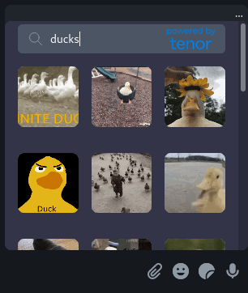
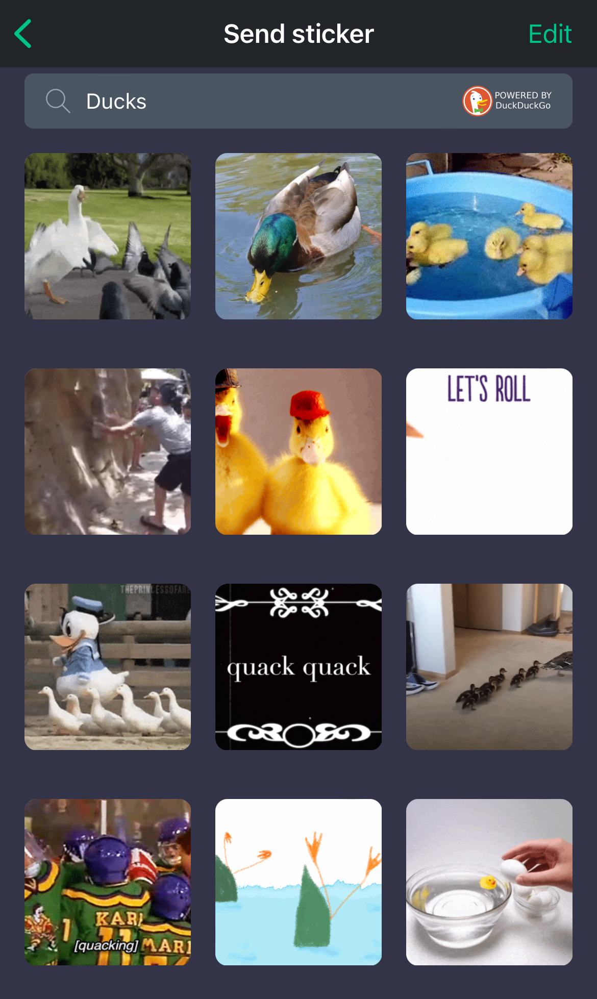
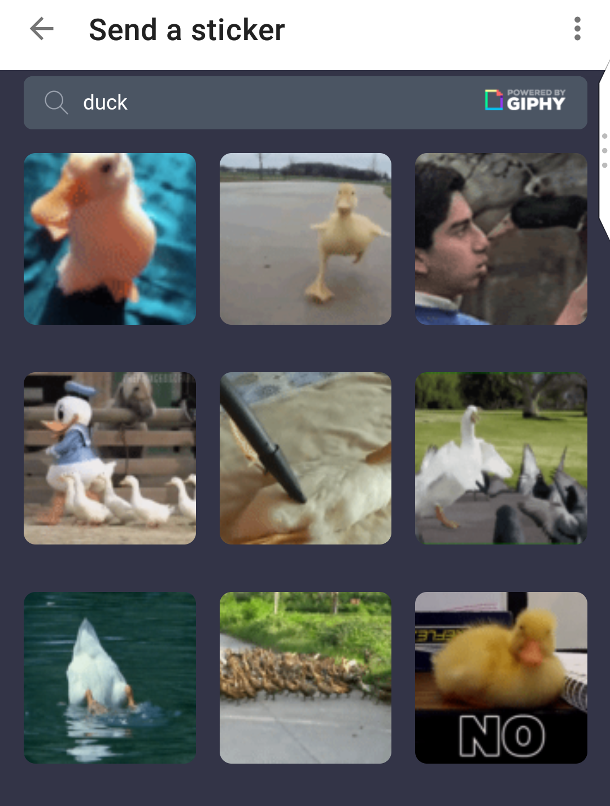
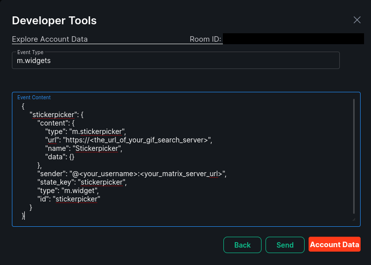

**Warning**: **Do not use this in production**. Due to a limitation in how stickers are implemented in the Element clients this widget exposes an endpoint that can be used to upload any image to your content repository.

**Note**: Following this guide **will replace** your current sticker-picker with a GIF keyboard. Be sure to **backup** your current `m.widget` state if you wish to preserve it. This currently does not work as a standard widget and must replace the sticker-picker.

# Matrix GIF Keyboard
This project seeks to add a GIF keyboard to Matrix in the form of a widget that can replace the sticker-picker. Currently, there are three backend GIF APIs supported: Giphy, Tenor, and DuckDuckGo (which can pull from a variety of sources). Primary support is targeted for the Element Matrix clients (Web/iOS/Android). SchildiChat has also been tested and is the preferred client on Android at this time.

**Matrix room:** [#gifkeyboard:matrix.treilly.dev](https://matrix.to/#/#gifkeyboard:matrix.treilly.dev)

Element Web:



Element iOS:



Element Android:



## Requirements
* A Matrix access token for an account that can upload images to the content repository. In my case I made an account called `gifbot` for this purpose.
* A Matrix server that won't blacklist you for uploading a ton of GIFs
* (Optional) [GIPHY](https://developers.giphy.com/docs/api#quick-start-guide) or [Tenor](https://tenor.com/developer/keyregistration) API key if you plan to use these services directly
* (Optional) Docker to build and run the included Dockerfile

## Quick start using Docker
### 1. Server setup
After cloning the repository build the Docker image by issuing the following in the top-level directory:

```
docker build . -t gifkeyboard
```

Once the image is built, you can run it with `docker run` by passing your configuration options as environment variables.
```
# GIPHY
docker run -d -p 3000:3000 -e MATRIX_ACCESS_TOKEN=<matrix_token_for_image_uploads> -e GIPHY_API_KEY=<GIPHY_API_KEY> -e HOME_SERVER_URL=https://<your_matrix_server> gifkeyboard
# Tenor
docker run -d -p 3000:3000 -e MATRIX_ACCESS_TOKEN=<matrix_token_for_image_uploads> -e TENOR_API_KEY=<TENOR_API_KEY> -e HOME_SERVER_URL=https://<your_matrix_server> gifkeyboard
# DuckDuckGo
docker run -d -p 3000:3000 -e MATRIX_ACCESS_TOKEN=<matrix_token_for_image_uploads> -e HOME_SERVER_URL=https://<your_matrix_server> gifkeyboard
```
**Note:** The backend API will be determined by the API key (or lack thereof). Only pass one key at a time. If no key is passed, DuckDuckGo will be used by default.

### 2. Reverse proxy setup
I will not be covering the setup of a reverse proxy, but one should be set up to proxy traffic to your server with proper SSL certifcates. In my tests I have used a [Cloudflare Tunnel](https://developers.cloudflare.com/cloudflare-one/tutorials/single-command) to expose the application to the web (which, while not recommended, can even work from within a home network), but you can just as easily use your favorite reverse proxy (NGINX, HAProxy, etc.). You can find a guide to setup containerized NGINX as a reverse proxy [here](https://www.digitalocean.com/community/tutorials/how-to-secure-a-containerized-node-js-application-with-nginx-let-s-encrypt-and-docker-compose).

### 3. Enable widget
Log into a client that supports access to the `devtools` such as Element web with the account you want to use the GIF keyboard from. Enter `/devtools` in the message box. Select `Explore Account Data`.

Select `m.widgets` and then click "Edit". Enter the following in the `Event Content` text box and then click "Send":
```
{
    "stickerpicker": {
        "content": {
            "type": "m.stickerpicker",
            "url": "https://<the_url_of_your_gif_search_server>",
            "name": "Stickerpicker",
            "data": {}
        },
        "sender": "@<your_username>:<your_matrix_server_url>",
        "state_key": "stickerpicker",
        "type": "m.widget",
        "id": "stickerpicker"
    }
}
```
It should look something like this:



#### To disable the widget (and bring back the default sticker app)
Enter `/devtools` in the message box. Select `Explore Account Data`.

Select `m.widgets` and then click "Edit". Enter the following in the `Event Content` text box and then click "Send":
```
{}
```

## Running the Node app directly
If you would rather not use Docker, perhaps for testing or development purposes, you can run the application by first exporting the environment variables (e.g. `export HOME_SERVER_URL=<SERVER_URL>`, `export TENOR_API_KEY=<API_KEY>`, `export MATRIX_ACCESS_TOKEN=<ACCESS_TOKEN>`) and then issuing the following in the repository folder:
```
node src/server.js
```
## Customization options
You may further customize the server setup by setting environment variables. This is the full list of currently supported configuration options:
```
# #####################################################
# API keys
# #####################################################
GIPHY_API_KEY=<GIPY_API_KEY>
TENOR_API_KEY=<TENOR_API_KEY>

# #####################################################
# Matrix server URL (where GIFs will be uploaded)
# #####################################################
HOME_SERVER_URL=<MATRIX_SERVER_URL>

# #####################################################
# Access token to perform upload to above Matrix server
# #####################################################
MATRIX_ACCESS_TOKEN=<MATRIX_ACCESS_TOKEN>

# #####################################################
# Safe search and content rating
# #####################################################
# TENOR 
# Default: low. off (R), low (PG13), medium (PG), or high(G) more info here: https://tenor.com/gifapi/documentation#contentfilter
TENOR_CONTENT_RATING=<off|low|medium|high>

# GIPHY 
# Default: PG13. MPA style ratings. More info here: https://developers.giphy.com/docs/optional-settings#rating
GIPHY_CONTENT_RATING=<r|pg13|pg|g>

# DuckDuckGo
# Default: 1. off (-1), moderate (1). Currently no support for strict safe search due to an API limitation.
DUCKDUCKGO_SAFE_SEARCH=<-1|1> 

# #####################################################
# DuckDuckGo site search list
# Provide a list of sites DuckDuckGo can pull GIFs from. Note: OR must be capitalized.
# #####################################################
DUCK_SEARCH_LIST=site:site1.com OR site:site2.org OR site:site3.net // Default: site:tenor.com OR site:giphy.com
```
To set the environment variables issue:
`export VARIABLE_NAME=VARIABLE_VALUE`
or pass it to a docker run command with:
`-e VARIABLE_NAME=VARIABLE_VALUE`


## Limitations 

### GIFs must first be uploaded to the Matrix Server
While some clients (like [FluffyChat](https://fluffychat.im/)) allow the stickers with remote URLs to be displayed, none of the Element clients support this behavior. We circumvent this by first uploading the GIF to a Matrix server content repository. This is an *unacceptable* solution from a production perspective, not only because the GIF will take up disk, but because there is no way to secure the widget to prevent abuse. Matrix content repository settings can throttle excessive requests, but there is no way to authenticate that the user belongs to the server they are trying to upload to simply from data available to the widget. One could pass the username and the origin server to the widget, but this is easily faked and hardly worth implementing for that reason. Any suggestions on other solutions are welcomed!

The current Matrix API spec states the following for an `m.sticker` `url` parameter:
```
Required: The URL to the sticker image. This must be a valid mxc://URI.
```
The `m.image` object has a less strict requirement for its `url` paramter:
```
Required if the file is unencrypted. The URL (typically MXC URI) to the image.
```
Despite this ambiguous language (*typically MXC URI*), trying to send an `m.image` with a non-mxc uri in a `m.room.message` event fails in all Element clients.


### DuckDuckGo API backend
DuckDuckGo does not actually provide a documented public API for GIF search, so there a few limitations in comparison with the other services:

#### No control over GIF preview/upload size
When using DuckDuckGo for search we are not able to access thumbnails, previews, or different sizes of the GIFs returned. This can cause slower load times as well as larger files being uploaded.

#### No trending GIFS
By default, prior to a search being entered the homepages of both the GIPHY and Tenor powered keyboards will show trending GIFs. Because DuckDuckGo is a search engine there is no concept of trending images (at least as far as I could find). Instead, a default search term corresponding to the day of the week on the client-side is used.

#### No strict safe search
The API I am using currently does allow the most strict search filter DuckDuckGo offers. If this is a concern, please use the environment variable `DUCK_SEARCH_LIST` to limit GIF search to websites whose content you deem acceptable.

#### Image size in bytes calculated at run time
GIPHY and Tenor both supply information about the size of the images they provide. DuckDuckGo does not, so it gathered from the Buffer object prior to upload.

#### API availability/stability is not guaranteed
The DuckDuckGo is not a public, documented API so it could be subject to change with little notice.

### Element Android App
#### Gifs do not autoplay
On Android, animated stickers (GIFs in our case) do not autoplay but they can be sent and received successfully. An [issue](https://github.com/vector-im/element-android/issues/2668) is open regarding this behavior. For the best experience with the GIF keyboard on Android, please try [SchildiChat](https://schildi.chat/) on which animated stickers will autoplay.

## Stack
1. Node
2. Express w/ Handlebars
3. Tailwind
4. Jquery
5. Axios